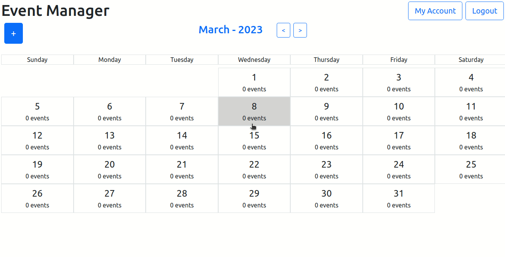

# Event Manager API

Api for event management (inspired by Google Calendar).

The frontend can be access [here](https://github.com/vitor-msp/event-manager-react)



## Execution

1. Clone this repository
```
git clone https://github.com/vitor-msp/event-manager-api.git
```

2. Access the downloaded folder
```
cd event-manager-api
```

3. Run the docker-compose

```
sudo docker-compose up -d
```

## Notes

1. The port 8080 in your machine must be free